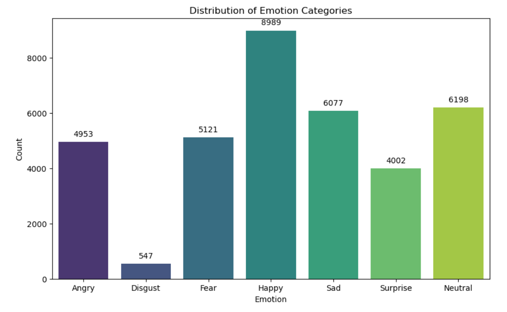
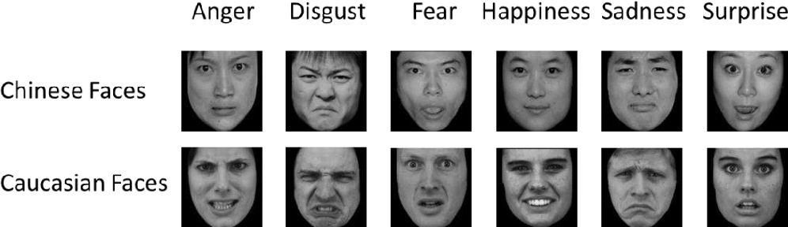

# Mini-Project for Fundamentals of Machine Learning Course

This repository contains the code and data for a mini-project on facial expression recognition using machine learning algorithms.

## 📑 Project Policy
- Team: group should consist of 3-4 students.

    |No.| Student Name    | Student ID |
    | --------| -------- | ------- |
    |1| Ngô Đức Minh | 21110126 |
    |2| Lê Thị Thảo Nhi | 21110138 |
    |3| Đặng Thị Kim Anh | 21280084 |
    |4| Nguyễn Phúc Loan | 21280098 | 

- The submission deadline is strict: **11:59 PM** on **June 22nd, 2024**. Commits pushed after this deadline will not be considered.

## 📦 Project Structure

The repository is organized into the following directories:

- **/data**: This directory contains the facial expression dataset. You'll need to download the dataset and place it here before running the notebooks. (Download link provided below)
- **/notebooks**: This directory contains the Jupyter notebook ```EDA.ipynb```. This notebook guides you through exploratory data analysis (EDA) and classification tasks.

## ⚙️ Usage

This project is designed to be completed in the following steps:

1. **Fork the Project**: Click on the ```Fork``` button on the top right corner of this repository, this will create a copy of the repository in your own GitHub account. Complete the table at the top by entering your team member names.

2. **Download the Dataset**: Download the facial expression dataset from the following [link](https://mega.nz/file/foM2wDaa#GPGyspdUB2WV-fATL-ZvYj3i4FqgbVKyct413gxg3rE) and place it in the **/data** directory:

3. **Complete the Tasks**: Open the ```notebooks/EDA.ipynb``` notebook in your Jupyter Notebook environment. The notebook is designed to guide you through various tasks, including:
    
    1. Prerequisite
    2. Principle Component Analysis
    3. Image Classification
    4. Evaluating Classification Performance 

    Make sure to run all the code cells in the ```EDA.ipynb``` notebook and ensure they produce output before committing and pushing your changes.

5. **Commit and Push Your Changes**: Once you've completed the tasks outlined in the notebook, commit your changes to your local repository and push them to your forked repository on GitHub.


Feel free to modify and extend the notebook to explore further aspects of the data and experiment with different algorithms. Good luck.

## :bulb: Interesting Findings
1. **Data Imbalance**
In the facial expression dataset, a significant imbalance exists in the distribution of emotions. The dataset consists of the following counts for each emotion category:

With this imbalance, the model might become biased towards the more prevalent classes like "Happy" (8989 images) and "Neutral" (6198 images) while underperforming on the minority class "Disgust" (only 547 images).
To ensure that the model pays adequate attention to underrepresented emotions and improves overall performance across all emotion categories., there are some techniques we can use:
•	Oversampling:  a technique used to address the issue of imbalanced datasets by increasing the number of samples in the minority class. The two main methods are:
    + Random Oversampling: randomly select samples from the minority class and duplicating them until the class sizes are balanced. 
    + Synthetic Oversampling: generates new synthetic samples by interpolating between existing minority class samples.
•	Bootstrap: Each bootstrap sample is created by randomly selecting instances from the original dataset with replacement, allowing the same instance to appear multiple times in a sample.

By applying these techniques, we can build more reliable emotion classification models that can generalizing across diverse emotional expressions better.

2. **Cultural Difference**
People from different parts of the world show their feelings on their faces in different ways. For example, people from Western countries like the United States or Europe use different muscles in their faces to show emotions like happiness, sadness, and anger very clearly. But people from East Asian countries, like China or Japan, might not show these feelings as clearly, and sometimes their facial expressions for different emotions look more similar to each other. The below picture shows how different the same emotion categories look like between Chinese and Caucasian:

In addition, bone structure or size of face can also be a factor that affects the model's performance on face emotion detection. This means that if we train the model on a dataset of Western faces, it wouldn't give the best results when being applied on Asian faces; generally speaking, it might work better for people from some places than others because of these differences.

To solve this problem, we need to use lots of different kinds of pictures from all over the world. People in different countries can show their feelings in different ways. By looking at pictures from many places, the computer can learn better and understand emotions no matter where someone is from.
It's also helpful if we tell the computer how different cultures show emotions. When the computer learns about these differences and uses them to learn, it can recognize feelings correctly for everyone, no matter where they live.


